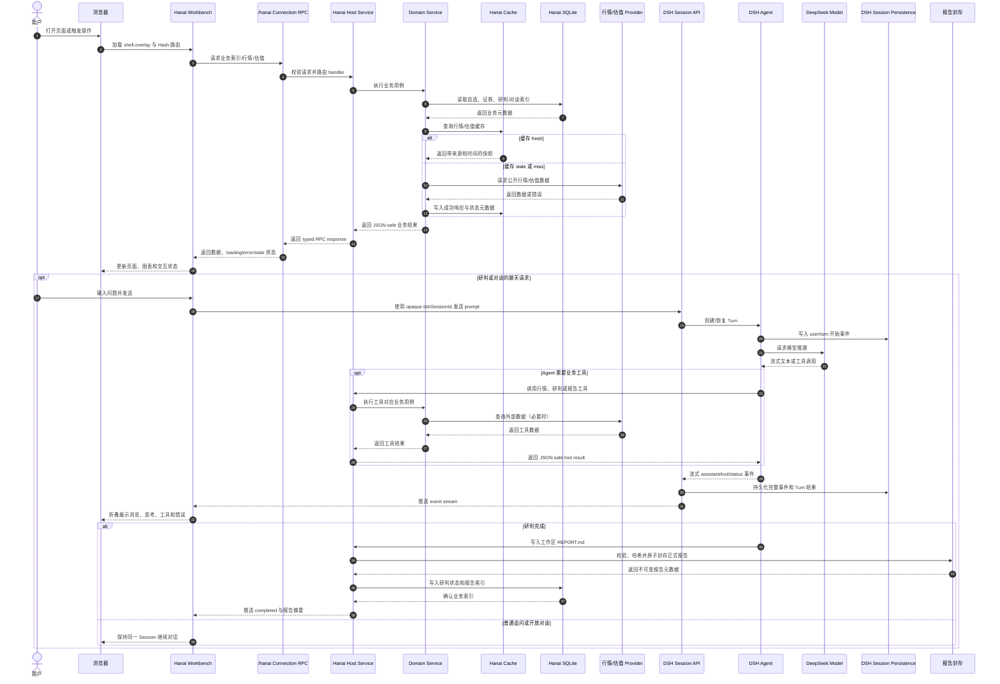
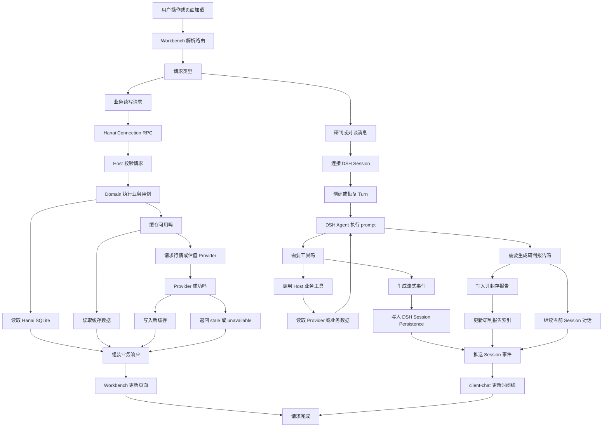
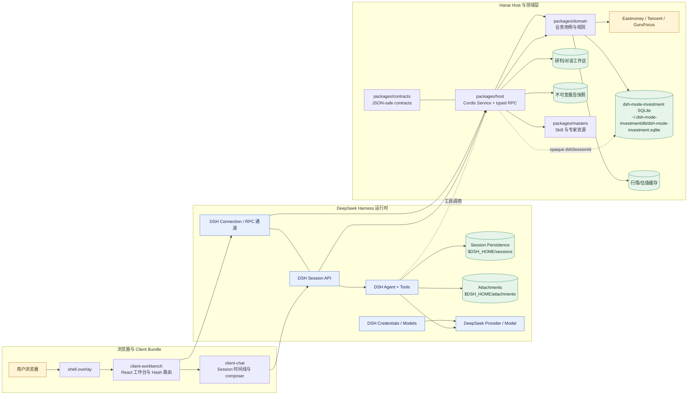

# AGENTS.md

dsh-mode-investment是一个本地优先的 A 股价值研究工作台，以 DeepSeek Harness（DSH）提供 Agent、模型、工具、Session 和事件持久化，以本仓库提供行情、估值、自选、研判、专家对谈、报告和 React 工作台。

本文件是后续自定义开发的入口。先遵循这里的流程，再根据任务分支读取对应文档；不要凭记忆猜测 DSH API 或项目约定。

## 开始工作

1. 确认工作目录是仓库根目录，并查看 `git status --short`。
2. 阅读本文件；涉及架构、数据所有权或跨层边界时，继续阅读 [`docs/architecture.md`](docs/architecture.md)。
3. 涉及安装、Profile、启动、浏览器验收或数据隔离时，阅读 [`docs/startup-and-verification.md`](docs/startup-and-verification.md)。
4. 涉及产品语义、页面、图表或视觉基线时，阅读 [`README.md`](README.md)、[`docs/client-parity.md`](docs/client-parity.md) 和 [`docs/brand.md`](docs/brand.md)。
5. 涉及变盘点、回测或研究产物时，先阅读 [`docs/turning-point-research-index.md`](docs/turning-point-research-index.md) 与 [`scripts/research/README.md`](scripts/research/README.md)。
6. 涉及架构取舍时，先查 [`docs/README.md`](docs/README.md) 的 ADR 索引；已有决策应优先遵循，必要时新增 ADR。
7. 修改前先定位真实入口、调用方和测试；避免只改 UI 表象或复制第二份状态。

完成标准：已确认任务边界、数据所有权、受影响层、验证命令和需要更新的文档。

## 项目结构

- `packages/contracts`：Host/Client 共享的 JSON-safe TypeScript 合约。
- `packages/domain`：证券、自选、行情/估值 Provider、研判、专家对谈、报告和路径逻辑。
- `packages/host`：Cordis Service、`/hanai` RPC、DSH Session 桥接、Agent 编排和持久化边界。
- `packages/client-workbench`：全屏 React 工作台、Hash 路由、页面、图表和业务交互。
- `packages/client-chat`：研判/对谈的 DSH Session 时间线、composer、队列、steer、取消和审批交互。
- `packages/masters`：专家 Skill、参考资料、能力元数据和安装/校验资源。
- `tooling/dsh-client-bundle`：锁定 DSH 版本的 Client Bundle 构建适配器。
- `scripts`：Profile 安装/校验、macOS LaunchAgent 后台服务、发布包校验和可复现研究脚本。
- `docs`：架构、ADR、产品基线、验收证据和研究索引。
- `tests` 与各 package 下的 `tests`：单元、集成和客户端行为测试。

## 运行时可视图

下面三张图是后续开发时的运行时基线：时序图回答“一个请求经过哪些组件”，流程图回答“请求如何分支和收敛”，架构图回答“组件和数据所有权如何分层”。修改 RPC、Session、Provider、报告或数据存储边界时，先同步检查这三张图与 [`docs/architecture.md`](docs/architecture.md)。

### 运行时请求时序图



### 请求处理流程图



### 运行时架构图



图中约束：Client 不直接访问 Node.js、SQLite、文件路径或 Provider；Hanai 业务数据不复制 DSH 消息；Agent 的工具调用可以回到 Host/Domain，但聊天事件的最终事实记录仍回到 DSH Session Persistence。

## 核心数据来源与稳定性

### 数据分层

| 数据层 | 当前来源 | 作用与稳定性策略 |
| --- | --- | --- |
| 证券主数据 | 东方财富 A 股证券列表 | 首次/每日同步到 `security_master`，生成交易所、拼音和 `secId`；快照不足 1,000 条时拒绝替换旧快照 |
| 实时行情与市场概览 | 东方财富实时接口 | 指数、市场宽度、板块、榜单、报价和财务快照的主源；每次响应携带 provider、来源时间、抓取时间和 fresh/stale 状态 |
| 延迟行情 | 东方财富延迟接口 | 实时源失败或被限流时的同源降级；必须标记为 `delay/stale`，不能当作实时数据 |
| 历史 K 线 | 东方财富复权 K 线接口 | 日/周/月 K 线主源，使用前复权；分页和日期游标用于获取更早日线 |
| K 线与分时备源 | 腾讯行情接口 | 东方财富历史 K 线、分时失败时使用；腾讯历史 K 线成交额不可靠时保留 `null`，不补零 |
| 合理估值与价值曲线 | GuruFocus 中国站接口 | 估值摘要、MEDPS/价格序列和维度评分；接口未获授权再分发，当前应视为个人研究接口，不作为唯一事实源 |
| DSH 会话与模型事件 | DSH Session Persistence / Credentials / Model | Agent、消息、工具事件、凭据和附件的唯一事实源，不进入 Hanai SQLite |
| 业务索引 | 本地 Hanai SQLite | 只保存证券、自选、研判/对谈、报告元数据和 opaque `dshSessionId` |

### 当前已实现的稳定性保护

- **统一传输层**：所有 Provider 通过可注入 `HttpClient` 访问，统一处理超时、HTTP 状态、JSON 解析错误；Node 侧默认超时约为行情 8 秒、腾讯 10 秒、估值 15 秒。
- **限流与串行节流**：东方财富请求使用队列和最小请求间隔，避免并发突发触发封禁；主数据分页请求失败会进行有限重试。
- **多主机与降级**：东方财富实时/历史接口轮换多个 host；实时源失败可切延迟源，分时和周/月 K 线可切腾讯备源。
- **熔断**：连续实时失败会进入冷却；总失败达到阈值会短暂熔断，避免持续打爆失效数据源。
- **最近成功快照**：报价失败时优先返回进程内最近成功报价，并明确标记 `cache`/`stale`；没有快照才返回 `unavailable`。
- **估值持久缓存**：估值按证券键写入文件缓存，默认 TTL 24 小时；新请求失败时返回旧估值并标记 `stale`，缓存文件权限为目录 `0700`、文件 `0600`。
- **局部失败隔离**：股票详情的报价、分时、日/周/月 K 线和估值分别独立加载；单个 Provider 失败不会让整个详情页不可用。
- **缺失值语义**：无法取得或不可靠的字段保持 `null`，前端显示 `—` 或隐藏；不得把缺失成交额、估值或财务字段补成 0。
- **研究冻结口径**：回测和研究必须冻结 cutoff、证券宇宙、参数、来源和哈希；新样本使用新版本/新日期，不回写旧产物。

### 要达到“稳定数据”的生产级方案

当前实现是“在线源 + 进程/文件缓存 + 降级”，不是历史数据仓库。若要长期稳定、可复现和可审计，后续应增加独立采集链：

1. **采集与展示解耦**：定时任务从各源拉取原始响应，写入带 `source`、`fetched_at`、`source_timestamp`、请求参数、HTTP 状态和内容哈希的 append-only 原始层；页面只读本地规范化层。
2. **规范化与校验**：统一 `secId`、交易日、时区、前复权口径和字段单位；校验日期单调、OHLC 关系、非负成交量、重复键、异常跳变和证券数量阈值，失败批次不覆盖上一版。
3. **版本化快照**：按交易日和数据版本保存证券主数据、日 K、财务、估值和市场快照；每个快照可回溯到原始响应，禁止原地覆盖已用于研究的版本。
4. **主备源对账**：关键字段用东方财富与腾讯交叉检查；差异超阈值进入 quarantine，不自动选择“看起来更合理”的值；无法对账的字段保留来源标记。
5. **新鲜度门禁**：为每类数据定义最大允许延迟、最小覆盖率和最大缺口；超过阈值时返回明确的 `stale/unavailable`，不伪装成 fresh。
6. **可观测性与重放**：记录成功率、延迟、限流、解析失败、覆盖率、字段缺失率和源切换；保留失败请求的安全摘要，支持按日期重跑而不依赖当前接口结果。
7. **凭据与合规隔离**：API Key 只由 DSH Credentials 或受控运行环境管理；供应商授权、再分发限制和研究用途必须在文档中明确，不能把未授权接口包装成正式公共数据服务。

**开发判断准则**：实时数据追求“及时且有状态”，历史研究追求“版本固定且可复算”，估值追求“带来源和日期的参考值”；三者不能用同一份无元数据缓存混用。

## 不可破坏的边界

- **DSH 是聊天事实源。** Session 日志、消息、Turn、工具事件和附件只由 DSH 持有；不要在 Hanai SQLite 中增加 `messages`、`turns` 或聊天副本表。
- **Hanai SQLite 只保存业务索引。** 自选、证券主数据、研判/对谈索引、报告元数据和 opaque `dshSessionId` 属于 Hanai。
- **Host/Client 分离。** Host 处理 Node.js、网络、SQLite、文件、报告封存和 Agent 生命周期；Client 只能通过类型化 `/hanai` RPC、DSH Credentials/Models/Session API 和 Slot 获取数据或发起动作。
- **凭据不落业务库。** DeepSeek API Key 由 DSH Credentials 管理，禁止写入 SQLite、报告、日志、截图或前端持久化状态。
- **报告不可变。** 正式报告经过校验、哈希和原子封存；普通追问复用原 Session，不应静默创建新报告版本。
- **数据根隔离。** 新版 Hanai 数据默认位于 `~/.dsh-mode-investment`；不要检测、读取或导入旧版 `~/.hanai-investment-dsh` 或 `~/.hanai-investment`。
- **Profile 隔离。** 默认安装到 `mode-investment` Profile；不要修改官方 `web`/`headless` Profile，也不要把 DSH Base/Web App 作为 Profile dependency 重复安装。
- **产品语义优先。** K 线使用前复权；ECharts 图表类型、数据含义、A 股红涨绿跌语义和既有路由不可因重构随意改变。变盘点是量价观察提示，不得表述成买卖建议或收益承诺。
- **专家身份边界。** 专家 Skill 是 AI 方法论视角，不是真人参与或背书；具体时效事实必须检索核验，并保留反证与失效条件。

## 开发规则

- 使用 TypeScript、ESM、pnpm；Node.js `^22.19.0` 或 `>=24.0.0`，pnpm `11.7.0`。
- 新代码优先放入已有职责明确的 package；跨层共享类型放 `packages/contracts`，不要从 Client 直接导入 Host/Domain 内部实现。
- React 使用共享 React 单例、DSH Slot/标准 Props、CSS Modules 和现有语义 token；不要引入 Tailwind、shadcn、全局 reset 或第二套主题系统。
- UI 状态、加载态、错误态和 stale/unavailable 数据状态要显式建模；缺失值显示 `—` 或隐藏，不把空值解释为 `0`。
- RPC 合约、数据库 schema、报告格式或路由变化必须同时更新调用方、校验器、测试和相关文档。
- 研究产物必须记录 cutoff、证券宇宙、失败数、输入来源、参数和哈希；不要把诊断子集称为全量研究，不要覆盖旧日期产物。
- 每次改动保持单一目标、最小 diff；不要顺手重排无关文件或升级 DSH rc。需要升级依赖时先记录兼容性风险并运行完整门禁。
- 不提交 API Key、个人绝对路径、临时缓存、`node_modules`、构建产物或未经审阅的研究中间文件。

## 常用命令

```bash
pnpm install --frozen-lockfile  # 安装锁定依赖
pnpm run typecheck              # TypeScript 检查
pnpm run build                  # Host、Client、Profile tools 构建
pnpm run test                   # Vitest 全量测试
pnpm run pack:check             # 发布包 allowlist 与协议检查
pnpm run check                  # 完整门禁：typecheck + build + test + pack:check
pnpm run profile:install -- --package .
pnpm run profile:verify
dsh --profile mode-investment

# macOS 用户级后台服务
pnpm run service:install
pnpm start
pnpm stop
pnpm restart
pnpm status
pnpm run service:uninstall
```

运行单个测试时使用 `pnpm exec vitest run <path>`；运行研究脚本前先确认 cutoff 与参数，再使用 `pnpm exec tsx scripts/research/<script>.ts`。Profile 或浏览器行为变化需要在真实 DSH Host/Web 中启动后验收；不要自行启动替代 Web Server 冒充产品验证。macOS 后台服务使用 `pnpm run service:*` 管理，不手工编辑 LaunchAgent plist；Profile 安装或迁移前先停止服务，且不得将 API Key 写入服务环境。

## 任务流程

### 设计与实现

1. 写清用户可见行为、数据来源、失败/空/加载状态和完成标准。
2. 追踪从 Client → RPC → Host/Domain → Provider/DSH Session 的完整链路。
3. 先修改合约/领域模型，再接入 Host 和 Client；保持单一事实源。
4. 同步新增或修改测试；涉及持久化、报告、Profile 或跨层协议时补集成测试。
5. 只在必要时更新架构/ADR/产品文档，明确记录原因而不是复制实现细节。

### 验证

- 代码改动至少运行受影响 package 的测试和 `pnpm run typecheck`。
- 发布、依赖、Profile、Host/Client Bundle 或 DSH API 改动运行 `pnpm run check`、`pnpm run profile:verify`。
- UI 改动检查 Hash 深链、刷新、前进/后退、窄屏、明暗主题、加载/错误状态和水平溢出。
- 行情/研究改动核对来源、获取时间、复权口径、cutoff、缓存状态和缺失字段。
- 声称完成前保留命令输出或测试结果作为证据；失败时说明失败命令、原因和未验证边界。

完成标准：实现、测试、类型检查、必要的构建/Profile 验证和文档影响评估全部完成，且 `git diff --check` 通过。

## 会话收尾

1. 再次运行 `git status --short` 和 `git diff --check`。
2. 检查是否留下临时文件、凭据、绝对路径或不应提交的构建产物。
3. 更新受影响的 README、架构文档、ADR、研究索引或验收文档；无文档影响时明确说明。
4. 汇报修改文件、验证命令、结果和已知风险；不要把未运行的验证写成已通过。
5. 若任务由多人/多 Agent 协作，记录每个变更的来源、冲突处理和最终验证结果。

## Definition of Done

- [ ] 需求边界和数据所有权明确。
- [ ] 实现位于正确层，未复制 DSH Session 或业务事实源。
- [ ] 受影响测试、类型检查和构建已运行并记录结果。
- [ ] Profile、凭据、数据隔离和发布边界未被破坏。
- [ ] UI/研究/架构文档已按需更新。
- [ ] `git diff --check` 通过，仓库可由下一次会话直接接续。
