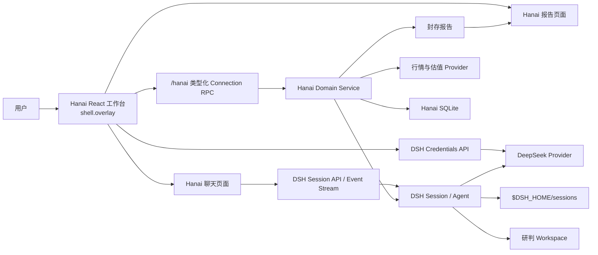
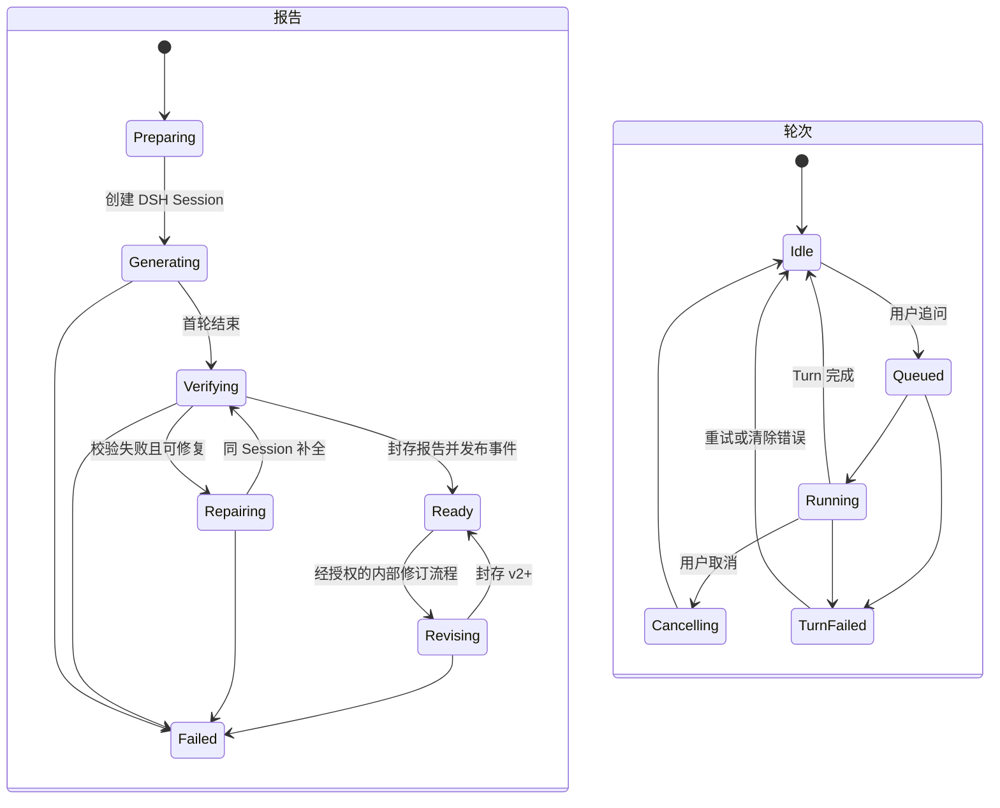

# Hanai Worth · 值见 DSH 总体架构设计

- 状态：核心架构已实现
- 更新日期：2026-08-23
- DSH 分析基线：`deepseek-harness@b150a551b8d465e31e418e1b2eaf5e79bbb7d28e`

## 1. 结论

Hanai Worth · 值见当前以兼容包名 `dsh-mode-investment` 实现为一个树外 DeepSeek Harness Bundle。它复用 DSH 的模型、凭据、Agent、Session、会话历史、流式事件和 Web Client 插件机制；Hanai Worth 自己拥有股票、行情、估值、自选、大师研判、专家开放对谈、报告版本和聊天呈现等业务能力。

新 UI 全部使用 React 重写，并保留旧版五页基线；2026-08-23 新增一级“专家对谈”，当前导航为“今日市场、自选与发现、大师研判、专家对谈、专家中心、设置与诊断”。个股、研判和对谈详情都是可直接访问的详情路由。`mode-investment` Profile 启动后在 `shell.overlay` 中自动挂载全屏常驻的 Hanai 工作台；Workbench 自己同步 Hash 路由，因此无需 DSH 新增通用 Router Slot。Hanai 自己渲染消息时间线和 composer，所有轮次仍发送给绑定的 DSH Session。

该结构不向 Hanai 用户展示 DSH 原生聊天页面，但仍复用 DSH 的 Session 持久化、Agent、队列、取消、恢复和事件流。Hanai 只重写呈现和交互层，不实现第二套 Agent 运行时或聊天存储。

## 2. 目标与非目标

### 2.1 目标

- 以可安装的 DSH Bundle 发布，不 fork DSH。
- 保留旧版五个一级页面的名称、相对顺序、布局和交互，并新增不绑定股票或报告的“专家对谈”。
- 使用 ECharts 复原板块 `treemap`、分时/日周月 K 线、五维雷达和价值曲线的数据及交互语义。
- 使用 DeepSeek 模型生成大师研判报告。
- 页面可以设置、删除和验证 DeepSeek API Key，但不读取或保存明文副本。
- 每份报告与一个持久 DSH Session 绑定，报告完成后可以和原大师持续对话。
- 每次开放对谈与一个独立持久 DSH Session 和专家快照绑定，但不创建或封存 `REPORT.md`。
- 正式报告通过校验、哈希和原子封存保持不可变；版本机制是内部实现边界，不作为新增的一级产品能力。
- 通过 `location.hash` 提供旧路由语义对应的 deep-link、刷新恢复以及浏览器前进/后退。
- 提供普通亮色和黑夜模式；主题切换只替换语义 token，不改变 DOM、尺寸、顺序、图表数据或业务色。
- 新旧数据目录完全隔离，新版只初始化自己的空数据根。
- 桌面和本地优先，不建设 Hanai 云端业务后端。

### 2.2 首版非目标

- 不恢复旧 Codex Thread；它不能转换成 DSH Session。
- 不把 Hanai 消息复制到第二套 Conversation/Message 表；DSH Session 日志是聊天事实源。
- 不支持在已有对话中原地切换大师；切换大师创建新 Session 或 Fork。
- 不引入 shadcn、Tailwind 或第二套全局主题。
- 除 ADR-0004 接受的“专家对谈”外，不随意增加一级页面或改变既有行情、研判、人物与图表语义。
- 不检测、读取或导入旧版 `~/.hanai-investment`。

## 3. 系统结构



### 3.1 数据所有权

| 数据 | 所有者 | 默认位置 |
| --- | --- | --- |
| DeepSeek API Key | DSH Credentials | `$DSH_HOME/.credentials.yaml` |
| 模型及普通 DSH 设置 | DSH Settings | `$DSH_HOME/settings.yaml` |
| 会话事件、消息和工具历史 | DSH Session Persistence | `$DSH_HOME/sessions` |
| 聊天附件 | DSH Attachment Service | `$DSH_HOME/attachments` |
| 自选、证券主数据、研判与对谈业务索引 | Hanai | `~/.dsh-mode-investment/db/dsh-mode-investment.sqlite` |
| 研判工作区 | Hanai | `~/.dsh-mode-investment/judgements/<id>/workspace` |
| 正式报告快照 | Hanai | `~/.dsh-mode-investment/judgements/<id>/reports` |
| 研究计划快照 | Hanai | `~/.dsh-mode-investment/judgements/<id>/plans` 或 `expert-chats/<id>/plans` |
| 专家对谈工作区 | Hanai | `~/.dsh-mode-investment/expert-chats/<id>/workspace` |
| 行情和估值缓存 | Hanai | `~/.dsh-mode-investment/cache` |

详细规则见 [ADR-0002](adr/0002-data-root-isolation.md)。

## 4. 仓库结构

```text
dsh-mode-investment/
├── docs/
├── packages/
│   ├── contracts/              # Host/Client 共享的 JSON-safe TypeScript 合约
│   ├── domain/                 # 股票、自选、估值、研判与报告领域逻辑
│   ├── host/                   # Cordis Service、Connection RPC、Agent 编排和持久化
│   ├── client-workbench/       # 侧栏入口、全屏 Hanai 工作台和业务页面
│   ├── client-chat/            # 报告详情、消息时间线和 composer
│   └── masters/                # 六位专家 Skill、参考资料、能力分流及版本元数据
├── tooling/
│   └── dsh-client-bundle/      # 锁定 DSH 基线的最小 Client Bundle 构建适配器
├── package.json
├── pnpm-workspace.yaml
└── tsconfig*.json
```

DSH 当前没有发布稳定的树外 Client Plugin 构建 SDK。首版在本仓库维护一个最小构建适配器，生成 DSH Module Loader 所需的单文件 `client.js`，并通过真实 Profile 启动测试约束兼容性。该适配器必须锁定 DSH 版本，不能从相邻源码目录做隐式相对导入。

## 5. Bundle 与插件装配

### 5.1 Bundle

仓库根包同时声明 `dsh.bundle` 与 `dsh.client` 两个 sibling role，`cordis.patch.yml` 是 Bundle Patch。它装配：

- Hanai Host Service；
- Hanai `/hanai` Connection RPC；
- Hanai 数据库和 Provider；
- `client-workbench` 的 Host/Client 两面；
- `client-chat` 的 Host/Client 两面；
- 研判 Session Projection；
- 大师资源发现与工作区安装器。

插件安装到独立的 `mode-investment` Profile。Profile 由 DSH Base、Web App 和 dsh-mode-investment Bundle 组成；官方 `web` Profile 保持不变。Hanai 不覆盖凭据、Session Persistence 或 WebServer，并只禁用会覆盖 Hanai 首次配置体验的原生 Models Onboarding Surface。

### 5.2 Host/Client 边界

- Host 负责网络、SQLite、文件、报告封存、数据库版本升级和 Agent 生命周期。
- Client 只通过 `/hanai` 类型化 Connection RPC、DSH Credentials/Models API、DSH Session hooks 和 Slot 注入读取状态、发起动作。
- Client 组件不接触 Node API、文件路径、SQLite 或 Cordis `ctx`；`ctx` 仅存在于插件 `apply()` 和 inject 工厂。
- 跨插件 UI 组合只使用 DSH Slot，不从另一个业务插件导入其内部 React 组件。

## 6. React UI 设计

### 6.1 入口和页面容器

`client-workbench` 在 `shell.overlay` 注册 Hanai 工作台，并在插件激活后直接显示。生产配置中工作台没有“关闭并返回 DSH”动作；它是 `mode-investment` Profile 唯一的产品界面。开发配置可以显式启用宿主调试出口，但默认关闭，且不得成为用户导航的一部分。

`shell.overlay` 里的 “shell” 指 DSH 的页面框架，不是命令行 Shell。它是 `ui-layout` 在 Sidebar、Conversation 和 Details 之上声明的一个列表 Slot；Hanai 插件在这个最上层 Slot 中常驻渲染覆盖整个 Frame 的工作台。

```text
DSH AppFrame
├── sidebar
├── conversation
├── details
└── shell.overlay            # 最上层；Hanai Workbench 打开时占满 Frame
```

它的交互效果是完整的全屏应用，不是新窗口或 iframe。工作台根元素负责恢复 pointer events、焦点管理、滚动管理和窄屏布局；生产模式下 Escape 不会退出到 DSH 原生聊天。若工作台启动失败，必须渲染 Hanai 自己的故障页和重试/诊断操作，不得把原生 DSH Conversation 当作降级界面。

工作台是一个完整、常驻的 React Surface，内部导航状态与 `location.hash` 双向同步。空 Hash 默认进入 `#/dashboard`；刷新、直接访问、浏览器前进和后退均恢复同一页面。路由与旧版语义一一对应：

| 页面 | Hash 路由 | 结构边界 |
| --- | --- | --- |
| 今日市场 | `#/dashboard` | 六大指数 → 市场宽度 → 左侧板块热力图、右侧榜单 |
| 自选与发现 | `#/watch` | 分组工具栏 → 原字段/排序语义的自选表格 |
| 大师研判 | `#/judgements` | 股票/分析人筛选 → 三列研判卡片；详情为 `#/judgements/:id` |
| 专家对谈 | `#/expert-chats` | 对谈记录 → 专家选择或开放聊天；详情为 `#/expert-chats/:id` |
| 专家中心 | `#/personas` | 普通页头 → 两列专家信息卡 |
| 设置与诊断 | `#/settings` | Agent、数据源、本地存储、关于声明；DSH 凭据嵌入此页 |
| 个股详情 | `#/stock/:secId` | 行情与基本面左列、估值与价值曲线右列；不是一级导航 |

全局壳层也遵循旧版几何基线：176px 左侧栏、46px 顶栏、顶栏左侧股票搜索和一致的内容起点。主题按钮可以使用旧顶栏右侧空位，但不能挤压搜索或改变内容布局。

Overlay 只是 DSH 当前缺少通用业务页槽时的容器选择，不改变业务组件边界或 Hash 深链接。未来若 DSH 提供 `shell.page`，工作台各页面可以迁入新 Slot，而 Host、Domain、RPC、路由语义和页面组件保持不变。

### 6.2 报告与 Hanai 自有聊天

用户打开研判后始终停留在 Hanai Workbench。生成中和失败时继续展示旧版执行过程；报告 `ready` 后默认展示旧版两栏报告（左侧归档信息、右侧 Markdown）。唯一新增的可见入口是“研判报告 / 继续对话”视图切换；聊天视图使用同一个 `dshSessionId`，不跳转到 DSH 原生 Conversation。

报告区域展示：

- 股票、大师、模型和信息时点；
- 报告 Markdown；
- 版本、生成时间、字节数和 SHA-256；
- 数据来源/免责声明。

聊天区域由 `client-chat` 提供，负责：

- 通过 `dshSessionId` 加载 DSH 持久历史；
- 将 Session 事件折叠为用户消息、助手消息、流式草稿、工具活动和错误状态；
- 提供输入框、发送、队列、steer、停止/取消、审批和问题响应；
- 处理断线重连、冷 Session 恢复和历史分页；
- 切换 Session 时重挂聊天桥接与本地交互状态，避免不同研判串话；
- 在同一 Session 忙碌时禁止并发创建第二个研判 Turn。

DSH 继续负责：

- Session 创建、日志持久化和冷恢复；
- Agent、模型路由、大师工作区和工具执行；
- prompt queue/steer、取消和状态事件；
- 用户/助手/工具事件的完整事实记录。

Hanai 不创建 `messages` 或 `turns` 表。聊天页从 DSH 历史和实时事件构建视图，浏览器中只保存未发送草稿等纯 UI 状态。DSH 原生 `ui-conversation` 可以继续随 Web Profile 装载，但 Hanai 产品入口不导航到它，也不依赖它的内部 React 组件。

### 6.2.1 专家开放对谈

开放对谈拥有独立的 `expert_chats` 业务索引与 `expert-chats/<id>/workspace`，不复用 `judgements` 的证券字段、报告状态机或封存目录。每次创建会复制一份不可变专家 Skill，并写入开放对谈专用 `AGENTS.md`；空白对谈不发送合成用户 prompt，带开场问题时只发送用户原文。

段永平、混江龙、查理·芒格、沃伦·巴菲特和 Serenity 支持研判与开放对谈；孙宇晨视角标记为 `chatOnly`，客户端不显示在研判创建器，Host 也拒绝绕过创建。孙宇晨页面持续展示真人模拟声明，Skill 和工作区共同要求时效事实先核验、行业周期给出反证，并禁止把操纵、欺骗或规避监管转化为执行建议。

Serenity 标记为 `planFirst`：其个股研判与开放对谈都在同一 Session 内先制定并封存 `PLAN.md`（研究计划），校验通过后自动进入研究阶段；研判随后生成并封存 `REPORT.md`，开放对谈继续在聊天时间线中回答，不生成报告。研究计划与报告以同一套 SHA-256 原子封存口径入库。

对谈消息、工具与 Turn 历史和研判续聊一样只由 DSH 保存。Hanai SQLite 的标题只是业务导航元数据，不是消息摘要或可独立恢复的会话副本。完整决策见 [ADR-0004](adr/0004-open-expert-conversations.md)。

### 6.3 组件与样式

UI 遵循 DSH Web 规范：

- React `^18.2.0`，运行时使用 DSH 共享的 React 单例；
- DSH Slot 和标准 Props shares；
- DSH `ui-primitives` 优先，包括 Button、Input、Menu、Modal、Tooltip、Toast、Markdown 和图标；
- CSS Modules 和 `clsx`；
- Workbench 根节点继承 `--dsw-alias-*`，并在自身作用域映射普通 `light` / `dark` 两套 `--hanai-*` 语义令牌；黑夜模式以旧版客户端为视觉基线，亮色模式只替换颜色、阴影和图表辅助线 token；
- 两个主题复用同一 DOM、组件树、文案、尺寸、间距、断点和图表 option；A 股涨红跌绿、专家识别色与状态业务色不随主题反转；
- 不使用 Tailwind、shadcn 或全局 reset；
- DSH 缺少的复杂控件优先用本地 React + CSS Modules 实现；只有确有无障碍/交互价值时才引入无样式 headless primitive。

旧版图表语义由 ECharts `5.6.0` 复原，不用普通 DOM 方块或自绘 SVG 替代：

- 今日市场使用 ECharts `treemap`；面积为板块成交额，颜色为板块涨跌幅，保留行业/概念、tooltip、“其他”合并和点击钻取。
- 个股行情使用 ECharts 分时折线、成交量与日/周/月 K 线，默认日 K，保留 A 股红涨绿跌和 dataZoom。
- 估值区使用 ECharts 五维雷达；价值曲线按日期分别传入真实价格与 MEDPS，逐点生成 `0.7/0.9/1.0/1.1/1.3` 倍估值带，缺失值不补零、不跨日期混配。
- ECharts tooltip、axis、grid、legend、dataZoom 和辅助色读取主题 token，但 series 类型、顺序、字段、面积、坐标和业务色保持不变。

ECharts 会进入树外 Client Bundle，因此包体门禁仍需监控；包体成本不能成为改变图表类型或数据语义的理由。

详细决策见 [ADR-0001](adr/0001-dsh-native-react-ui.md)。

### 6.4 DeepSeek API Key 页面

Hanai 设置页复用 DSH Credentials 和 Provider API，不建立自己的 secret store。页面仅提供：

- 当前是否已配置；
- 凭据来源和是否可写；
- 写入或替换 Key；
- 删除受管 Key；
- 读取 DSH 当前可用的 Provider 与模型目录。

规则：

- Key 输入只存在于受控组件的临时状态，提交后立即清空。
- Host 和 Client 日志禁止记录 Key、请求头或完整错误对象中的 secret。
- API 永不返回明文 Key。
- 环境变量提供的 Key 是高优先级只读来源，页面不得伪装写入成功。
- Key 不进入 Hanai SQLite、缓存、报告、Session 自定义事件或浏览器存储。

## 7. 大师研判与持续对话

### 7.1 核心不变量

- 一条 `Judgement` 最多绑定一个根 DSH Session。
- 一条已创建 Session 的 `Judgement` 必须记录 `masterId` 和 `dshSessionId`。
- 报告状态与 Session/Turn 状态分离。
- 报告 `ready` 不意味着 Session 结束或归档。
- Session 一旦产生内容，不能原地更换大师。
- UI 的正式报告来源永远是封存快照，不是可变的工作区 `REPORT.md`。

### 7.2 生命周期

报告与会话轮次是两个独立状态机：



推荐状态字段：

```text
reportStatus: preparing | generating | verifying | repairing | ready | revising | failed
turnStatus: idle | queued | running | cancelling | failed
```

二者不能合并。`reportStatus=ready` 与 `turnStatus=running` 是报告完成后用户正在追问的正常组合。

### 7.3 大师身份

首版通过以下三层保证恢复后仍是同一大师：

1. `Judgement.masterId` 和 Session 领域事件记录稳定身份；
2. 研判工作区保存本次使用的大师 Skill 快照；
3. 工作区 `AGENTS.md` 对整段 Session 约束大师身份、研究规则和报告文件语义。

如果 DSH 后续为树外 Bundle 提供稳定的 Preset Root Provider，再把支持研判的五位大师提升为独立 Agent Preset。后续升级不能改变已有 Session 的组合。

### 7.4 Session 事件与报告协调器

Host 订阅 DSH Session 的 `turn/start` 与 `turn/end`：报告状态处于生成、校验、修复或内部修订时，成功结束的 Turn 会进入报告校验与封存队列；普通追问只更新 `turnStatus`，不会创建报告版本。内部 revision 状态用于保证报告不可变和未来受控演进，不作为当前一级产品动作宣传。聊天页直接使用 DSH Client Runtime 已折叠的 Conversation Snapshot，因此不需要 Hanai 自定义消息 Projection。

发布顺序是：报告文件原子封存成功 → SQLite 事务提交报告版本和最新版本指针 → RPC 下一次读取可见。报告 Markdown 不复制进 DSH 消息或第二套消息表；UI 始终从正式封存文件读取。

### 7.5 报告封存

Agent 只写：

```text
judgements/<id>/workspace/REPORT.md
```

Host 校验通过后复制为：

```text
judgements/<id>/reports/0001/report.md
judgements/<id>/reports/0001/manifest.json
```

`manifest.json` 至少记录：

- judgement/report/version ID；
- 股票和大师；
- DSH Session ID；
- 模型路由；
- 创建和封存时间；
- 内容字节数和 SHA-256；
- Skill 版本；
- 来源报告工作副本；
- Schema 版本。

后续对话可以读取工作副本，但不能改变 UI 已展示的 v1。版本表和 revision 状态保留为实现边界；普通追问绝不生成 `0002`，任何未来可见的修订动作都必须另行获得产品授权。

## 8. 业务数据模型

SQLite 当前包含：

```text
schema_migrations
app_settings
security_master
watch_groups
watch_items
judgements
report_versions
expert_chats
```

`judgements` 的核心字段：

```text
id
sec_id / code / stock_name
master_id / master_version
dsh_session_id nullable
report_status
turn_status
latest_report_version nullable
created_at / updated_at / completed_at
error_code / error_message
```

`report_versions` 的核心字段：

```text
judgement_id / version
relative_path
sha256 / size_bytes
model_provider / model_id
sealed_at
manifest_version
```

`expert_chats` 只保存业务导航元数据：

```text
id / title
master_id / master_version
dsh_session_id nullable
turn_status
model_provider / model / reasoning_effort
created_at / updated_at
error_code / error_message
```

路径只保存相对 `dataRoot` 的值，禁止把某台机器的绝对路径写入持久化记录。

Hanai 不创建 `messages`、`turns` 或 `activities` 表。聊天历史、工具活动和 Turn 生命周期由 DSH Session 日志及 Projection 提供；Hanai 只保存业务关联和不可变报告。

## 9. Host Service 与 Connection RPC

Host 在 DSH Connection 上注册唯一的 `/hanai` channel。业务 endpoint 由共享 TypeScript map 约束：

```text
bootstrap / diagnostics.get / theme.set
dashboard.get / sector.stocks
security.sync / security.search / security.detail
watch.list / watch.quotes
watch.group.create / watch.group.rename / watch.group.remove
watch.item.add / watch.item.remove / watch.item.move
judgement.list / judgement.get / judgement.create / judgement.revise
```

DeepSeek Key 与模型目录不经过 Hanai RPC，而是直接调用 DSH 的 `credentials.describe/set/unset` 与 Models capability。所有 Hanai 返回类型是 JSON 兼容的普通数据；诊断页会显示本机绝对数据路径，其他业务记录只持久化相对路径和 opaque Session ID。

Provider 传输层使用 Node/DSH Host 能力重写，不能继续依赖 Electron `net.fetch`。东方财富、腾讯等源必须通过集成测试重新验证，并保留 provider fallback、抓取时间、来源和缓存状态。

## 10. 新版初始化与旧版隔离

新版第一次启动时只创建 `~/.dsh-mode-investment`，以空数据库开始。实现不得对 `~/.hanai-investment` 做存在性检查、目录遍历、数据库读取、文件复制或删除操作，也不提供导入按钮、迁移命令或兼容读取层。

旧版应用和目录可以继续独立保留。用户以后手动删除旧版数据属于独立的人工操作，不由本插件提供或触发。

详细数据所有权和备份规则见 [ADR-0002](adr/0002-data-root-isolation.md)。

## 11. 安全与权限

- Hanai 数据根目录创建为 `0700`；数据库、报告和 manifest 等普通文件创建为 `0600`。
- Agent 使用 `workspace-write`，写权限限定到当前研判工作区。
- 报告封存目录不作为 Agent cwd，也不授予 Agent 写权限。
- 不沿用旧版 `danger-full-access + never`。
- 网络 Provider 使用明确的目标和超时；错误消息在进入 UI 前脱敏。
- Connection RPC 默认只依赖 DSH 的 loopback 部署假设。若 WebServer 绑定非 loopback，必须先增加真实认证和 CSRF/Origin 策略。
- 报告属于投资研究辅助内容，界面和导出均保留数据时点、不确定性和非收益承诺提示。

## 12. 测试策略

### 12.1 单元测试

- 行情解析、证券标识和估值计算；
- SQLite migration 和事务；
- 报告校验、哈希、封存及版本冲突；
- 数据根路径 containment、目录权限和相对路径持久化；
- Client Store 和页面状态。

### 12.2 真实装配测试

- 从发布产物安装 dsh-mode-investment Bundle 到临时 DSH Profile；
- 启动 Host 和 Web Client Plugin；
- 验证 `shell.overlay` 自动常驻、原生 Conversation 不可见和 Hanai 聊天页面；
- 验证 Client Bundle 没有第二份 React；
- 验证 CSS 在卸载/HMR 后清理；
- 验证缺少 Host 注入时启动明确失败。

### 12.3 关键链路测试

- 无 Key 时进入配置页，写入 Key 后模型可用且 API 不回传明文；
- 创建研判 → 生成 → 校验/修复 → 封存 → 报告与聊天页面更新；
- 报告完成后同 Session 追问；
- 重启 DSH 后恢复 Session，仍使用同一大师工作区；
- 流式消息、取消、错误和断线重连在 Hanai 页面正确呈现；
- 后续对话不能改变已封存报告；
- 启动和业务请求都不会访问 `~/.hanai-investment`；
- 新数据根初始化失败时明确报错，不回退到旧目录。

## 13. 实现状态

| 子系统 | 状态 | 证据 |
| --- | --- | --- |
| 树外 Bundle / Client Bundle | 已实现 | 根包 sibling roles、单文件 `lib/client.js`、ModuleLoader 协议测试 |
| Domain / SQLite / 数据隔离 | 已实现 | 路径权限、migration、Provider 与报告封存测试 |
| 六页壳层与 Hash 路由 | 已实现 | 保留旧版五页并新增 `#/expert-chats`；全部详情路由可刷新并支持前进/后退 |
| 市场、自选、个股、估值 | 已实现 | 旧版布局、字段与真实 Provider 降级链；所有来源必须显示 fresh/stale/fallback |
| ECharts 图表 | 已实现 | treemap、分时/K 线、雷达和价值曲线；图表语义由固定 fixture 约束 |
| 大师研判与报告版本 | 已实现 | 独立工作区、能力包快照、同一 Session、原子封存与 SHA-256 |
| 专家开放对谈 | 已实现 | 独立业务索引/工作区/Session，不绑定股票或 `REPORT.md`，孙宇晨仅开放对谈 |
| Hanai 自绘聊天 | 已实现 | 历史、流式、工具树、queue/steer/cancel、审批、问题响应和生命周期冻结 |
| 亮色/黑夜主题 | 已实现 | 只切换 Workbench 语义 token，SQLite 持久化，布局与图表语义不变 |
| 独立 Profile | 已实现 | 临时 `DSH_HOME` 上真实安装、配置校验和随机端口启动 |
| 后续演进 | 持续 | 正式树外 Client SDK、更完整附件与供应商 SLA |

## 14. 首版验收标准

只有同时满足以下条件，首版才算完成：

1. 用户可以安装 Bundle 并启动 `mode-investment` Profile，且官方 `dsh web` 不受影响。
2. 页面可以配置 DeepSeek Key，明文不进入 Hanai 数据目录。
3. 保留旧版五个一级页面并新增“专家对谈”；个股、研判和对谈详情保留 Hash 深链语义。
4. 五位大师均可创建研判；六位专家均可创建开放对谈；每次任务有独立工作区和 DSH Session。
5. 报告校验后形成带 SHA-256 的不可变快照。
6. 报告和消息时间线出现在 Hanai 自有研判详情页中，不要求显示 DSH 原生聊天。
7. 用户可以通过 Hanai composer 在同一 Session 继续追问，重启后仍可恢复。
8. treemap、分时/K 线、雷达与价值曲线均由 ECharts 呈现，并保持旧版数据语义。
9. 普通亮色/黑夜模式只改变 token；两种主题的布局、DOM 和业务色一致。
10. Hash deep-link 可直接打开、刷新和前进/后退。
11. 新版不会检测或读取旧版 `~/.hanai-investment`。
12. Agent 没有报告封存目录或凭据文件的写权限。
13. 发布产物通过真实 DSH Profile 启动和关键链路测试。

## 15. 已知风险

- DSH 仍处于 pre-release，Client Bundle 和 Slot API 可能变化；必须锁版本并维护兼容测试。
- 当前没有通用 Page/Router Slot；Workbench 以 Hash Router 提供 deep-link，未来迁移 Slot 时必须保持既有路由语义。
- Client Bundle 是单文件 closure；新增第三方 UI/图表依赖必须受包体预算约束。
- 自有聊天页需要跟踪 DSH Session 事件语义；DSH 升级时必须通过历史折叠、流式、取消和恢复的兼容测试。
- 东方财富实时集群会拒绝部分 Node TLS 指纹；实现必须快速降级到东财延迟行情与腾讯分时/K 线，并在 UI 明确展示来源，不能标成 LIVE。
- DSH Session 当前没有完整删除能力，需要在产品中说明保留与清理策略。
- 大师成为正式树外 Agent Preset 仍依赖更稳定的 Preset Root 扩展能力。

## 16. DSH 基线参考

以下链接固定到本设计分析时使用的 DSH commit：

- [Bundle 发布与安装](https://github.com/deepseek-ai/deepseek-harness/blob/b150a551b8d465e31e418e1b2eaf5e79bbb7d28e/docs/user/develop/basic/publish.md)
- [Web 样式规范](https://github.com/deepseek-ai/deepseek-harness/blob/b150a551b8d465e31e418e1b2eaf5e79bbb7d28e/docs/web-styling.md)
- [根布局 Slot](https://github.com/deepseek-ai/deepseek-harness/blob/b150a551b8d465e31e418e1b2eaf5e79bbb7d28e/packages/client/ui-layout/src/client/index.ts)
- [Sidebar Slot](https://github.com/deepseek-ai/deepseek-harness/blob/b150a551b8d465e31e418e1b2eaf5e79bbb7d28e/packages/client/ui-sidebar/src/client/index.ts)
- [Session Host API](https://github.com/deepseek-ai/deepseek-harness/blob/b150a551b8d465e31e418e1b2eaf5e79bbb7d28e/packages/host/apiproxy/src/api/sessions.ts)
- [Client Session Runtime](https://github.com/deepseek-ai/deepseek-harness/tree/b150a551b8d465e31e418e1b2eaf5e79bbb7d28e/packages/client/runtime/src/client/sessions)
- [DeepSeek、Credentials 与 Session Persistence 装配](https://github.com/deepseek-ai/deepseek-harness/blob/b150a551b8d465e31e418e1b2eaf5e79bbb7d28e/packages/bundle/base/cordis.patch.yml)
