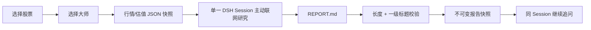
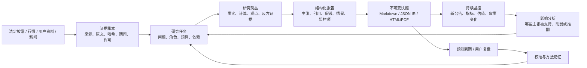

# Hanai Worth · 值见产品能力升级分析

- 调研日期：2026-08-17
- 产品基线：`dsh-mode-investment@7e27cd625ee1367382d9701c74d371625cae4917`
- 调研范围：当前仓库实现、`ideas.md` 中全部参考仓库，以及金融研究、Agent 协作、群体预测、研究工作台和质量评测领域的补充产品/仓库
- 文档性质：产品战略与落地建议，不代表下列能力已经实现

## 0. 结论先行

Hanai Worth 当前已经拥有一套难得的可靠底座：本地优先的 A 股工作台、明确的数据新鲜度语义、DSH Session 续聊、不可变报告快照、大师 Skill 快照，以及相对完整的桌面端研究界面。它现在最主要的瓶颈不是“缺少更多大师”或“缺少更大的 Agent 数量”，而是研究过程中的证据、分工、变化和结果仍没有成为可复用的产品对象。

因此，最值得投入的升级方向是：

> 从“选择一位大师，生成一份报告”，升级为“围绕一家公司持续积累证据、形成可反证判断、监控变化并复盘预测的本地研究系统”。

这意味着产品能力应按以下顺序建设：

| 优先级 | 能力 | 解决的核心问题 | 引入后的产品形态 |
| --- | --- | --- | --- |
| P0 | 证据账本与逐条引用 | 报告有链接，但用户无法快速核验每个关键判断 | 个股研究空间中的“资料 / 证据”页签、报告行内引用、来源侧栏 |
| P0 | 结构化研究报告与质量门 | 当前封存校验只保证“有标题且够长”，不保证事实可追溯、数字一致或观点完整 | 报告质量卡、阻断式校验、事实/推断/假设标记、可复现估值表 |
| P1 | 持续跟踪与研究收件箱 | 自选股只跟踪价格，报告完成后研究基本停止 | 自选页升级为覆盖台；公告、财务、估值、叙事变化触发研究任务 |
| P1 | 深度研究委员会 | 单一大师容易出现确认偏误，且采集事实与价值判断混在一起 | “独立研判 / 研究委员会 / 同股异见”三种研判方式及可见任务图 |
| P1 | 同业比较与叙事变化 | 目前是单公司、单时点视图，缺少横向和纵向比较 | 同业矩阵、跨期指标表、管理层表述差异、证据驱动的对比报告 |
| P2 | 情景实验室 | 群体预测容易制造虚假精确，但有助于发现二阶影响 | 有限情景树、利益相关方图、变量注入、可观测信号，不直接预测股价 |
| P2 | 决策日志与校准 | 系统会生成判断，但不会验证哪些判断后来成立 | 用户确认的研究决策、预测问题、到期复盘、Brier 分数与方法论记忆 |
| P2 | 受控能力中心 | DSH/Skill 生态可扩展，但直接安装会带来权限、许可和稳定性风险 | 数据源、研究 Skill、计算工具、权限、版本、健康状态和评测结果目录 |

建议把北极星指标定义为：

> **有效研究覆盖率**：自选覆盖公司中，拥有未过期证据、明确核心假设、反方证据和下一次验证条件的公司占比。

它比“生成报告数”“聊天轮数”或短期投资收益更能反映 Hanai 是否真正提高了用户的研究能力。

## 1. 调研方法与判断边界

本报告采用三类证据：

1. **仓库事实**：阅读当前 [README](../README.md)、[总体架构](architecture.md)、[客户端基线](client-parity.md)、Host/Domain/Contracts、报告封存逻辑和四位大师 Skill。
2. **开源实现**：以官方仓库 README、架构文档和关键实现为主，分析 `ideas.md` 所列 DeepSeek Harness、AgentTeams、金融 Skills、TradingAgents、MiroFish、BettaFish。
3. **成熟产品范式**：参考 OpenBB、AlphaSense、Quartr、Koyfin 等官方产品资料，提取已经被真实研究工作流验证的交互模式。

以下原则贯穿全部判断：

- “参考”不等于“作为依赖引入”。很多价值来自产品机制，而不是代码复用。
- 不把 GitHub 热度当作产品价值，也不把多 Agent 数量当作研究质量。
- 开源许可、数据授权、爬虫稳定性、模型成本和金融合规是产品约束，不是实现后的补充事项。
- 群体模拟输出是条件化假设，不是事实，也不应包装成确定的股价预测。
- 当前仓库的 DSH/Host/Session 边界是优质资产；升级应扩展研究领域对象，而不是重新实现一套 Agent 或消息系统。

## 2. Hanai Worth 当前能力地图

### 2.1 已经形成的产品资产

| 领域 | 当前能力 | 评价 |
| --- | --- | --- |
| 市场与个股 | 大盘、板块热力图、榜单、搜索、自选、个股行情、基本面、估值和价值曲线 | 已具备完整入口和较高信息密度，是后续研究能力的稳定承载面 |
| 来源状态 | `fresh / cached / stale / unavailable`，并展示来源时间和抓取时间 | 明显优于只显示数字的原型；可直接扩展为文档和证据的 provenance 模型 |
| 大师研判 | 四位大师 Skill、独立工作区、固定身份、主动联网研究 | 方法论资产较深，不只是简单 system prompt |
| Agent 运行 | DSH 负责模型、工具、Session、事件、持久化和恢复 | 边界正确，避免维护第二套 Agent runtime |
| 报告治理 | 工作副本校验、原子封存、版本、SHA-256、manifest | 技术完整性较好，可演进为研究制品系统 |
| 报告后续 | 报告完成后在同一 DSH Session 追问 | 上下文连续，是“持续研究”可以建立的基础 |
| 本地与隐私 | 独立数据根、Key 归 DSH、浏览器不接触文件系统和 SQLite | 适合个人高敏感投研资料，也形成差异化定位 |
| 工程质量 | 类型化 RPC、Provider 降级、缓存、权限、打包和集成门禁 | 足以支撑增量演进，不需要先做架构重写 |

当前事实依据可见 [共享合约](../packages/contracts/src/index.ts)、[HanaiService](../packages/host/src/service.ts)、[ReportStore](../packages/domain/src/reports.ts) 和 [大师资源](../packages/masters/assets)。

### 2.2 当前研究链路



这条链路已经能完成一次高质量研判，但它的中间过程大多只存在于 Agent 工具历史和最终 Markdown 中。证据、研究问题、分歧、假设和后续观察项没有成为 Hanai 可查询、可比较、可触发新任务的领域数据。

### 2.3 关键能力缺口

#### 1. 来源元数据停留在“行情表面”，没有进入“报告论证”

当前 `ProviderMeta` 对行情来源表达得很好，但 Agent 联网找到的公告、财报、访谈和行业资料只作为报告中的自由文本链接存在。产品无法回答：

- 这条结论具体来自哪一页、哪一段、哪个时间点？
- 同一个数字是否在两个来源中口径冲突？
- 报告中哪些关键主张没有证据？
- 新公告到来后，哪些旧结论受影响？

#### 2. 报告封存可靠，但内容质量门仍很弱

当前 `ReportStore.validateWorkingReport()` 的硬校验主要是最小字符数和一级标题。它保证文件存在和不可篡改，却不能保证：

- 必需章节齐全；
- 核心数字带期间、单位和来源；
- 引用真实可访问且支持相邻主张；
- 事实、推断、假设和未知项被区分；
- 乐观/基准/悲观情景内部一致；
- 反方证据足够强，而不是象征性风险列表。

#### 3. “大师”同时承担采集、分析、裁决和表达，职责耦合

四位大师 Skill 是宝贵资产，但当前每次研判只有一个大师负责整条链路。方法论视角会影响搜索路径，容易造成选择性取证。更稳健的结构应是：

1. 专业分析角色先建立共享证据包；
2. 多空/法务式审阅者挑战证据和推理；
3. 大师作为判断镜头解释同一组事实；
4. 主笔整合共识、分歧和未知项。

#### 4. 自选是价格列表，不是研究覆盖台

当前自选能够分组、排序和显示加入以来表现，但没有：研究状态、最后核验时间、核心假设、失效条件、公告变化、估值触发、下一事件和待办。这使用户每天仍需自己判断“今天该研究什么”。

#### 5. 报告是单公司、单时点文档，缺少可比较结构

没有同业矩阵、跨期叙事差异、关键 KPI 历史、估值假设表或报告版本差异。用户很难快速回答“这家公司相对谁更好”“管理层说法发生了什么变化”“本次结论为什么与上次不同”。

#### 6. 没有结果反馈，Agent 不会从错误中学习

报告保存了当时判断，但没有把预测拆成可到期验证的问题，也没有记录结果、基准、误差和复盘。未来的同类分析无法可靠读取“哪些模式曾经失效”。

#### 7. 扩展能力存在于代码和 Skill 中，用户看不见其边界

DSH 是插件化基座，大师也是 Skill，但产品没有能力目录、权限声明、来源覆盖、版本、健康状态和评测结果。继续增加 Skill 会迅速形成不可管理的隐式能力集合。

#### 8. 数据授权和模型成本尚未成为显式产品状态

东方财富、腾讯、GuruFocus 及未来的公告、新闻、社媒来源在用途、稳定性和再分发上差异很大。多 Agent 与群体模拟也会显著增加 Token、搜索和外部服务成本。用户需要在任务发起前看见来源范围、预算和风险，而不是完成后才发现。

## 3. 产品升级原则

### 3.1 证据先于智能

把可靠来源、原文定位、数据口径和内容哈希做成底层对象。Agent 的输出应该引用这些对象，而不是只给一个 URL。

### 3.2 事实层与判断层分离

“财务数字是什么”“管理层说了什么”属于事实层；“护城河是否变强”“估值是否有安全边际”属于判断层。大师 Skill 应主要负责后者。

### 3.3 研究制品先于聊天记录

DSH 继续拥有完整聊天事实源；Hanai 只新增有业务意义的制品：证据、主张、假设、情景、监控规则、报告和复盘。不要复制消息或工具事件。

### 3.4 从一次性报告转向持续覆盖

一份报告不是终点，而是带有“信息时点、失效条件、下一验证事件”的版本。新证据到来时，系统先指出受影响主张，再由用户决定是否生成修订版。

### 3.5 多 Agent 必须带来可审计分工

每个 Agent 必须有独立输入、输出契约、停止条件和质量指标。只有“角色名称不同、共享同一段上下文”的多 Agent 不值得引入。

### 3.6 计算必须可复现，预测必须可校准

估值、同比、现金流和情景敏感性应由确定性计算工具生成；LLM 负责解释。预测必须记录概率、期限和判定规则，不能只保存模糊观点。

## 4. `ideas.md` 所列仓库分析

### 4.1 DeepSeek Harness 与 `dsh-plugin` 生态

**它是什么。** [DeepSeek Harness](https://github.com/deepseek-ai/deepseek-harness) 是以“Everything is a Plugin”为核心的 Agent harness，提供 Session、模型、工具、Skill、MCP、Host/Client 插件和 Web UI。官方同时明确它仍处于 developer preview，存在破坏性变更。`dsh-plugin` topic 目前更像发现入口，而不是具备权限、签名、兼容矩阵和质量评级的成熟商店。

**真正值得借鉴的点。** 不是再暴露一层通用聊天，而是保持“薄业务层 + 强运行时”的边界：DSH 负责 Agent 生命周期，Hanai 负责金融领域状态和界面。

**对 Hanai 的价值。**

- 新的研究任务、子 Agent、工具审批、取消、恢复和模型路由可以继续复用 DSH。
- 未来数据源、计算器、导出器和监控器可按受控插件/Skill 形态扩展。
- Session 事件可以驱动研究任务时间线，而不必另造流式协议。

**引入后的产品形态。** 设置页增加“能力与来源”区域，展示每项能力的版本、权限、依赖、支持市场、数据用途、最近健康检查和评测结果；研究发起器根据可用能力显示可执行的研究模板。

**建议。** 继续锁定 DSH 兼容区间并维护真实 Profile 门禁；不要直接把 GitHub topic 做成一键安装商店。第一阶段只允许 Hanai 发布包内置或签名白名单能力。

### 4.2 `dsh-agent-teams`

**它是什么。** [dsh-agent-teams](https://github.com/NanmiCoder/dsh-agent-teams) 把当前 Session 变成 captain，可创建持久子 Agent、依赖感知任务 DAG、耐久邮箱、自动调度和可恢复尝试，并提供团队活动面板。其重要工程细节包括：任务依赖、原子领取、`attempt_id` 防止过期 Worker 写回、冷恢复和归档历史。

**真正值得借鉴的点。** “多 Agent”价值来自可恢复任务系统和清晰交付物，而不是并行生成更多文本。任务 DAG 也是让用户理解深研过程的最佳 UI 模型。

**对 Hanai 的价值。**

- 可把“财务、业务、竞争、政策、市场、反方、来源审计”拆成可观察任务。
- 单个角色失败时只重试一个任务，不必重跑整份报告。
- 每项任务产出独立 artifact，便于追责、复用和增量更新。

**引入后的产品形态。** “研究委员会”详情页不显示通用 Agent 名单，而显示业务化任务图：资料准备 → 专项研究 → 多空质询 → 证据审计 → 主笔成稿。用户能看到负责人、状态、来源数量、成本和失败原因，并能只重试某一节点。

**建议。** 可先复用设计和状态模型，再评估作为可选 DSH Bundle 依赖。Hanai 必须把最终任务结果固化为自己的研究制品，不能把 `.agent-teams/` 内部文件当成长期业务 API。该仓库为 MIT，但 DSH 预发布期仍有兼容成本。

### 4.3 `gauss314/skills`

**它是什么。** [gauss314/skills](https://github.com/gauss314/skills) 是遵循 `SKILL.md` 规范的金融能力集合，覆盖宏观、行情、基本面、筛选、SEC、期权定价、回测和组合优化。其优势是把“如何调用某一来源或计算工具”做成可安装的细粒度能力，而不是一个巨大金融 Agent。

**真正值得借鉴的点。** 数据来源和金融计算应该是组合式能力；每项能力有明确安装边界、输入输出和依赖。

**对 Hanai 的价值。**

- 形成 A 股专用能力包：法定公告、财务三表、业绩说明会、同业比较、杜邦分析、DCF、分红和解禁等。
- 大师不再自己临时发明数据获取方法，而是调用已验证能力。
- 计算 Skill 可把确定性结果写入证据包，减少 LLM 算术错误。

**引入后的产品形态。** “能力中心”按数据、计算、研究模板三类展示 Skill；任务发起前列出会使用的能力、所需凭据、预计调用和数据许可。研判报告显示“本次使用能力”清单。

**建议。** 借鉴目录和封装方式，不要直接全量安装。该仓库大量能力面向境外市场，部分依赖 scraper，甚至包含交易连接；Hanai 应默认禁止交易类能力，并把所有来源接入统一 provenance、限流、缓存和许可策略。仓库为 MIT，数据本身不因此获得再分发许可。

### 4.4 TradingAgents

**它是什么。** [TradingAgents](https://github.com/TauricResearch/TradingAgents) 用真实交易机构的角色分工组织多个 Agent：市场、情绪、新闻和基本面分析员先产出报告，多头和空头研究员辩论，Research Manager 裁决，Trader 形成计划，激进/中性/保守风险角色再辩论，Portfolio Manager 最终决策。当前实现还包含结构化输出、checkpoint、分层报告和带结果反思的持久 decision log。

**真正值得借鉴的点。**

- 专业分工与投资哲学分离；
- 正反双方必须基于同一证据交锋；
- 关键 handoff 使用结构化 schema，而非靠正则解析自由文本；
- 决策在结果已知后复盘，并把短小教训注入未来任务。

**对 Hanai 的价值。** 当前大师研判最需要的正是反确认偏误、角色化证据生产、结构化裁决和结果反馈。

**引入后的产品形态。**

1. “独立研判”：保持当前单大师体验，速度快、成本低。
2. “研究委员会”：专业分析员并行建立证据，反方审计后由所选大师主笔。
3. “同股异见”：四位大师独立阅读同一冻结证据包，页面展示共识、分歧、关键假设和各自遗漏，而不是合成一个虚假共识。

**建议。** 复用角色分工、结构化 handoff 和复盘机制，不直接复制其面向交易执行的最终动作。Hanai 的核心输出应是“研究结论 + 失效条件 + 待验证项”，不是仓位、止损或自动下单。仓库为 Apache-2.0。

### 4.5 MiroFish

**它是什么。** [MiroFish](https://github.com/666ghj/MiroFish) 从种子材料构建 GraphRAG、实体关系和带长期记忆的人格 Agent，在 OASIS 社交模拟环境中交互，再由 ReportAgent 查询模拟世界并生成预测报告；用户还能注入变量或与模拟角色继续互动。

**真正值得借鉴的点。** 它把“预测”从一句模型猜测变成一个可查看假设、参与者和二阶反馈的实验环境。对投资研究而言，最有价值的不是上千 Agent，而是利益相关方图、事件注入和路径依赖。

**对 Hanai 的价值。** 可用于产品涨价、监管变化、渠道冲突、供应链中断、行业价格战等情景的二阶影响推演，尤其适合消费、平台、产业链和政策敏感公司。

**引入后的产品形态。** 个股“情景”页中，用户选择一条核心假设，系统展示：参与者图 → 外生变量 → 3 至 5 条可能路径 → 各路径支持/反对证据 → 未来可观察信号。允许修改变量重新运行，并与情景中的角色或总览 Agent 对话。

**建议。** 不把 MiroFish 直接包装成股价预测器，也不应在早期运行大规模 swarm。先做有限、可解释、预算受控的情景树；所有概率明确标记为模型条件化判断。MiroFish 为 AGPL-3.0，且依赖外部记忆与高消耗模拟，若复用代码需单独完成许可和架构评审。

### 4.6 BettaFish

**它是什么。** [BettaFish](https://github.com/666ghj/BettaFish) 将 Query、Media、Insight 等不同数据 Agent 并行运行，通过 ForumEngine 主持多轮研究方向调整，最后由 Report Agent 选择模板、规划篇幅、逐章生成、校验 Document IR，并渲染交互式 HTML/PDF。它还强调公域和私域资料结合、社媒抓取及多模态处理。

**真正值得借鉴的点。**

- 数据采集 Agent 按来源和工具隔离；
- 主持人不是简单总结，而是发现缺口后重新分派研究；
- 报告先形成结构化 IR，再渲染多种输出；
- 章节级校验和修复优于一次性生成长 Markdown。

**对 Hanai 的价值。** 它提供了从“单 Agent 写报告”升级为“并行采集—论坛质询—结构装订—多格式输出”的完整参考。

**引入后的产品形态。** 深研过程显示每类资料的覆盖情况和论坛提出的下一步问题；报告可在 Markdown 之外提供交互图表、证据抽屉和 PDF 导出。用户可以点击某一章节重新核验，而不是重跑全篇。

**建议。** 优先借鉴 Report IR、章节校验和主持人补缺机制。不要直接引入其社媒爬虫集群；A 股舆情数据应先解决授权、个人信息、平台条款、反爬和样本偏差。BettaFish 为 GPL-2.0，闭源分发或代码组合前必须进行许可评审。

## 5. 补充先进产品与仓库分析

### 5.1 OpenBB 与 Agent Rita：数据契约和研究组件

[OpenBB Open Data Platform](https://github.com/OpenBB-finance/OpenBB) 的核心主张是“connect once, consume everywhere”：同一数据集可以被 Python、Workspace、Excel、MCP 和 REST 使用。其 Workspace 把 Widget 定义为带来源、元数据、参数和视觉层的基本数据单元；Dashboard 可以联动 ticker/date 参数，Agent 又能读取这些组件并把新表格、图表和文本 artifact 放回工作台。[Agent Rita](https://github.com/OpenBB-finance/agent-rita) 则展示了薄 Agent 如何搜索已有 widgets、获取数据、在进程内跑 SQL、修改 dashboard 并返回带引用答案。

**对 Hanai 的价值。** 当前 Contract 已有统一 JSON-safe RPC，可进一步抽象为“研究数据卡”契约，使同一财务表、公告时间线、同业比较或估值结果同时服务个股页、研判、监控和导出。

**引入后的产品形态。** 个股研究空间由固定但可组合的研究卡构成；所有卡共享 `secId / asOf / period / source` 参数。Agent 可以引用一张卡、生成新卡，用户可把有价值的结果固定到该公司档案。

**建议。** 借鉴 Widget metadata 和 artifact 回写机制，不在近期引入自定义空白 dashboard，以免破坏 Hanai 已建立的信息架构。OpenBB 主仓库为 AGPL-3.0；Agent Rita 为 MIT，二者许可边界不同。

### 5.2 FinRobot：可复现估值与专业报告生产

[FinRobot](https://github.com/AI4Finance-Foundation/FinRobot) 的 equity research 流程把财务数据获取、三年预测、DCF、同业比较、多个专项 Agent、图表和 HTML/PDF 报告串成一条生产线。其价值不在使用更多模型，而在先形成财务分析和预测数据集，再由 Agent 解释。

**对 Hanai 的价值。** 当前估值页已有 MEDPS、GF Score 和价值曲线，但正式研判中的估值仍主要是文字。Hanai 可增加确定性的估值工作簿，保存假设、公式、输入来源和敏感性矩阵。

**引入后的产品形态。** 报告中的估值章节嵌入可展开的“估值模型”：基准/乐观/悲观收入、利润率、资本开支、折现率和终值假设；用户调整一个输入后，只重算模型和受影响结论，并可生成新报告版本。FinRobot 为 Apache-2.0，但其默认境外数据源不适合直接用于 A 股。

### 5.3 TradingAgents-Astock 与 AKShare：A 股特化不是翻译

[TradingAgents-Astock](https://github.com/simonlin1212/TradingAgents-astock) 在原 TradingAgents 角色上加入政策、游资和限售解禁，并把 T+1、涨跌停、交易时段等制度约束显式建模。[AKShare](https://github.com/akfamily/akshare) 则提供覆盖广泛的中国金融数据接口和 AKTools HTTP 形态，同时明确数据主要用于学术研究，部分接口会因目标网站变化而失效。

**对 Hanai 的价值。** A 股研究角色和事件类型必须本地化：政策传导、监管问询、业绩预告、限售解禁、股东减持、重大合同、龙虎榜等不能由美股模板自然推导。

**引入后的产品形态。** 研究发起器按投资期限选择专项模块：长期价值研究默认财务/竞争/资本配置；事件研究可选政策、解禁、异常交易和情绪。所有模块仍使用同一证据账本。

**建议。** 可以把 AKShare 作为研究覆盖和故障降级的候选适配层，不把它等同于有 SLA 的商业数据源；正式产品仍应优先接入法定披露平台或有授权的数据服务。A 股事实来源优先级应从 [巨潮资讯网](https://www.cninfo.com.cn/)、[上海证券交易所](https://www.sse.com.cn/) 和 [深圳证券交易所](https://www.szse.cn/) 开始。

### 5.4 AlphaSense、Quartr、Koyfin：成熟产品已验证的研究闭环

这三类商业产品提供了比“再做一个 AI Chat”更重要的产品启示：

| 产品 | 已验证的核心范式 | 对 Hanai 的启示 | 引入后的形态 |
| --- | --- | --- | --- |
| [AlphaSense](https://www.alpha-sense.com/platform/) | 引用可回到原文、内外部资料统一搜索、Deep Research、定时 Workflow Agent、监控 | 研究的终点不是答案，而是可核验制品和后续 push | 研究计划、行内引用、内部资料库、定时任务、变化摘要 |
| [Quartr](https://quartr.com/features) | 公告/演示/电话会全文搜索、关键词提醒、跨期 slide 比较、转录高亮 | 第一方 IR 材料与“叙事变化”本身就是高价值产品 | 公告时间线、管理层语句对比、关键词规则、原文高亮 |
| [Koyfin](https://www.koyfin.com/features/) | 自选列定制、筛选器、图表模板、价格/估值/技术/新闻提醒 | 日常使用来自监控和比较，而不是偶尔生成长报告 | 覆盖台、自定义研究列、信号中心、同业筛选和提醒 |

Hanai 不需要复制这些产品的数据广度，但应该复制它们的研究闭环：**搜索与核验 → 形成工作制品 → 固定到工作空间 → 持续监控 → 变化触发行动**。

### 5.5 FinanceBench、Qlib 与 RD-Agent：评测和实验边界

[FinanceBench](https://github.com/patronus-ai/financebench) 用带标准答案和证据页的真实财务问题评测 LLM；其公开样例提醒我们，金融 RAG 的“看起来合理”远不等于答对。[Qlib](https://github.com/microsoft/qlib) 提供从数据、模型、回测到组合和执行的量化研究链路，[RD-Agent](https://github.com/microsoft/RD-Agent) 又把因子和模型迭代自动化。

**对 Hanai 的价值。**

- 建立 A 股版回归集，验证数字抽取、期间口径、派生计算、引用定位和“不足以回答”能力。
- 把未来的因子筛选或量化实验隔离在“实验室”，每次输出携带数据集版本、样本区间、基准、交易成本和泄漏检查。

**引入后的产品形态。** 设置页增加“研究质量”面板，展示当前模型 + Skill 组合在内部金标集上的准确率、引用支持率、成本和延迟；量化能力成熟后再增加独立实验任务，不把未经验证的回测结果混进默认大师报告。

## 6. 目标产品：证据驱动的持续研究系统

### 6.1 目标闭环



### 6.2 核心领域对象

Hanai 不需要保存第二套消息，但需要新增以下业务对象：

| 对象 | 核心字段 | 产品用途 |
| --- | --- | --- |
| `ResearchMission` | 股票、模式、目标、信息时点、预算、根 Session、状态 | 替代“一个 judgement 等于整个世界”的扩展瓶颈 |
| `ResearchTask` | 角色、依赖、输入 artifact、输出 artifact、尝试、成本 | 支撑可重试任务 DAG 和过程可见性 |
| `SourceDocument` | 发布者、URL、本地授权副本、发布时间、抓取时间、哈希、许可/保留策略 | 形成可靠资料库和变更检测 |
| `EvidenceFragment` | 文档、页码/段落/时间戳、原文、结构化数字、内容哈希 | 支撑点击引用和精确核验 |
| `Claim` | 文本、事实/推断/假设/未知、期间、置信、支持/反对证据 | 让报告观点成为可计算、可更新对象 |
| `Hypothesis` | 核心假设、失效条件、观察指标、状态 | 将“长期跟踪什么”从段落变成任务 |
| `Scenario` | 外生变量、路径、条件概率、影响、观测信号 | 支撑有限情景推演和后续校准 |
| `MonitorRule` | 事件/指标/关键词、阈值、频率、冷却、目标主张 | 驱动研究收件箱，而不是只发价格提醒 |
| `ResearchArtifact` | 类型、生产者、输入哈希、模型/Skill 版本、内容、质量 | 保存专项分析、计算表、对比矩阵和报告 IR |
| `OutcomeReview` | 预测、判定日期、结果、基准、误差、复盘 | 建立方法论记忆和校准能力 |

### 6.3 信息架构：先增强现有页面，不急于增加一级导航

| 现有入口 | 升级后的职责 | 关键新增界面 |
| --- | --- | --- |
| 今日市场 | 从行情首页升级为“市场与研究雷达” | 自选重大变化、待处理研究、市场制度/政策事件；仍保留原有布局为主体 |
| 自选与发现 | 从价格列表升级为“研究覆盖台” | 研究状态、最后核验、下一事件、假设健康度、未读变化、估值触发、自定义列 |
| 个股详情 | 成为每家公司稳定的“研究空间” | `概览 / 财务 / 资料 / 证据 / 研判 / 情景 / 跟踪` 页签，报告和聊天仍在研判内 |
| 大师研判 | 升级为“研究任务中心” | 独立研判、研究委员会、同股异见；任务 DAG、成本、质量、报告版本差异 |
| 专家中心 | 从人物展示升级为“判断镜头库” | 每位大师适用问题、不适用问题、核心检查表、版本与历史表现；不营销人格模仿 |
| 设置与诊断 | 增加来源、能力、质量和预算治理 | 数据授权、Skill 权限、模型评测、任务预算、索引状态、备份与导出 |

这样可以在不立即推翻五个一级页面的前提下完成产品升级。只有当“研究收件箱”成为高频入口后，再评估是否把它提升为一级页面。

## 7. 七个能力模块及引入后的产品形态

### 7.1 证据账本 v1

**用户问题。** 我为什么相信这句话？这条数据是什么期间和口径？新资料是否推翻了旧判断？

**产品形态。**

- 个股“资料”页：公告、财报、业绩说明会、用户文件、网页和结构化数据的时间线。
- 个股“证据”页：按业务、财务、竞争、管理层、估值和风险分类的证据卡。
- 报告行内引用：点击后打开右侧原文抽屉，定位页码、段落或时间戳。
- 每条 Claim 明确显示“事实 / 推断 / 假设 / 未知”，以及支持、反对、冲突状态。
- 文档更新时显示差异，并列出被影响的 Claim 和报告版本。

**首版边界。** 优先支持法定公告、用户上传 PDF/Markdown 和当前 Provider 的结构化快照。新闻和社媒放到后续；全文只在授权允许时本地保留，否则保存元数据、哈希和用户可访问链接。

### 7.2 结构化报告与质量门

**用户问题。** 报告是否完整、数字是否一致、来源是否真正支持结论？

**产品形态。**

- Agent 先写 `report.json` 或等价 Research IR，Renderer 再生成 Markdown/HTML/PDF。
- 报告顶部显示质量卡：信息时点、关键主张数、引用覆盖、来源等级、冲突数、未验证项、模型/Skill 版本和成本。
- 关键数字可展开计算链；估值假设以表格和敏感性矩阵呈现。
- 报告封存前执行阻断式门禁；失败只重做受影响章节。
- 版本页面显示“新证据、结论变化、假设变化、监控项变化”，而不是仅保存多个全文。

**建议质量门。**

1. Schema 和必需章节完整；
2. 核心事实逐条有可定位证据；
3. 数字包含单位、币种、期间、口径；
4. 派生数字由确定性工具重算；
5. 引用时间不晚于报告 `asOf`，或明确标为事后资料；
6. 至少一个强反方证据和相应回应；
7. 情景假设内部一致；
8. 不输出收益承诺，不把缺失值解释为零。

### 7.3 深度研究委员会

**用户问题。** 单一大师是否遗漏了关键事实或只寻找支持自己的证据？

**产品形态。**

研究任务可选三个档位：

| 模式 | 角色 | 体验 | 适用场景 |
| --- | --- | --- | --- |
| 快速独立研判 | 一位大师 + 标准证据工具 | 接近当前速度和成本 | 初筛、熟悉公司、轻量复核 |
| 研究委员会 | 资料员、财务、业务/竞争、政策/事件、反方审计、所选大师主笔 | 可见任务图和专项制品 | 首次建仓前的深研、重大变化 |
| 同股异见 | 多位大师独立解释冻结证据包，裁判只提炼分歧 | 共识/分歧矩阵，不强行合并 | 方法论比较、降低确认偏误 |

任务详情展示：研究计划、每个任务状态、来源覆盖、专项结论、分歧、重试、Token/时间预算。用户看到的是“研究工作”，不是内部 Agent 调试日志。

### 7.4 研究覆盖台与监控收件箱

**用户问题。** 今天哪些公司发生了真正影响我判断的变化？

**产品形态。**

- 自选表新增：研究状态、上次报告、证据新鲜度、未读变化、下一事件、核心假设状态、估值区间位置。
- 用户可从报告中的“待持续验证清单”一键生成监控规则。
- 收件箱按影响排序：新公告、财务指标越界、估值进入区间、管理层叙事变化、政策/行业事件、来源失效。
- 每条通知不只说“发生了什么”，还说“影响哪条 Claim、为何重要、是否建议重开研究”。
- 用户确认后才创建修订任务；普通新闻不自动污染正式报告。

本地优先约束下，首版可在应用运行期间轮询；若要实现关机后的准实时提醒，需要独立后台服务或操作系统调度，必须单独获得用户授权。

### 7.5 同业比较与研究 Grid

**用户问题。** 单家公司数字是否优秀，必须放在同业和历史中判断。

**产品形态。**

- 选 3 至 10 家公司和统一期间，生成可保存的比较 Grid。
- 行为关键问题或指标，列为公司/期间；每个单元格带原始证据。
- 预置模板：盈利质量、资本效率、增长来源、现金转化、管理层指引、竞争优势、估值。
- Agent 可以针对整个 Grid 回答，但不能脱离单元格引用。
- 结果可固定到个股研究空间并作为委员会共享输入。

这是比早期开放“任意自定义 dashboard”更聚焦、更容易形成产品价值的组件化入口。

### 7.6 有限情景实验室

**用户问题。** 如果关键变量变化，哪些利益相关方会如何反应，结论在哪一步失效？

**产品形态。**

- 从报告的一条 Hypothesis 创建情景实验。
- 自动抽取公司、客户、供应商、竞争者、监管者和渠道关系图，用户先确认。
- 用户设置 1 至 3 个变量及范围，例如价格、需求、原材料、监管强度、竞争者动作。
- 系统生成有限路径和二阶影响，列出每条路径所需假设、证据和可观测信号。
- 支持变量对比、敏感性图和到期复盘。

**硬边界。** 不把 Agent 数量、模拟轮数或角色共识转换成“胜率”；不直接给精确目标价；没有可靠校准数据时只给相对可能性和不确定性说明。

### 7.7 决策日志、校准与能力中心

**用户问题。** 我的研究流程是否真的变好？哪些判断模式经常失败？

**产品形态。**

- 用户主动把报告中的判断保存为预测问题，填写概率、截止日期和判定条件。
- 到期后系统获取证据、建议结果，必须由用户确认后封存复盘。
- 展示总体及按大师/问题类型/期限的校准图、Brier 分数和常见错误模式。
- 复盘摘要作为受控记忆供未来任务检索，不修改历史报告。
- 能力中心展示模型、Skill、数据源组合在内部评测集上的表现、成本、延迟和最近回归。

研究质量不能只用股价涨跌衡量。应同时记录事实准确性、论证质量、预测校准和用户是否及时发现结论变化。

## 8. 建议路线图

### 阶段 0：定义可信研究契约（1 至 2 周）

目标是先把未来所有能力依赖的对象和标准定清楚。

- 定义 `SourceDocument / EvidenceFragment / Claim / Hypothesis / ResearchArtifact` schema。
- 定义来源等级、保留策略、许可字段和冲突规则。
- 选取 10 至 20 份 A 股年报/公告，制作第一批金标问题和证据位置。
- 为现有报告建立离线解析器，测量当前引用覆盖、数字错误和章节完整度，形成基线。

### 阶段 1：可信报告 MVP（3 至 6 周，最高优先级）

- 支持法定披露和用户文件进入本地资料库。
- 生成 Evidence Pack，并让当前单大师研判只能引用其中对象或明确标记外部来源。
- 引入 Research IR、行内引用、证据抽屉和质量卡。
- 将报告门禁从“长度 + 标题”升级为 schema、引用和数字一致性校验。
- 仍保留当前独立研判入口和同 Session 续聊，不引入多 Agent。

**完成定义。** 关键事实引用覆盖率达到初始目标；任意引用可在两次点击内回到原文；故意注入错误期间/单位的测试会阻止报告封存；现有报告快照和 Session 不受影响。

### 阶段 2：持续研究 MVP（第 7 至 12 周）

- 自选升级为覆盖台，增加上次研究、证据新鲜度、假设和下一事件。
- 支持公告/财务/估值/关键词规则以及研究收件箱。
- 新资料到来后生成 Claim 影响分析和报告版本差异建议。
- 上线同业比较 Grid 的两个预置模板。

**完成定义。** 用户可以从一份报告创建监控项；新公告不会自动修改正式报告；通知明确定位受影响 Claim；用户可从通知创建增量复核任务。

### 阶段 3：研究委员会（第 10 至 16 周，可与阶段 2 后半并行）

- 建立 `ResearchMission / ResearchTask` 与 artifact handoff。
- 先上线四个客观角色：资料、财务、业务/竞争、反方审计；再由一位大师主笔。
- 引入依赖 DAG、节点级重试、成本预算和执行时间线。
- 上线“同股异见”，要求不同大师读取同一冻结 Evidence Pack。

**完成定义。** 单节点失败不会重跑全任务；各角色输出符合 schema；最终报告能逐条追溯到专项 artifact；委员会相对单大师在金标集上的事实/反证覆盖有显著提升，且成本在用户可见预算内。

### 阶段 4：情景与学习闭环（第 17 周以后）

- 先做有限情景树和假设敏感性，不做大规模 swarm。
- 上线用户确认的预测问题、到期复盘和校准面板。
- 根据真实使用数据决定是否引入更复杂的社会模拟、量化实验和开放 Skill 安装。

### 优先级取舍

| 能力 | 用户价值 | 技术依赖 | 主要风险 | 决策 |
| --- | --- | --- | --- | --- |
| 证据账本 | 极高 | 文档采集、索引、引用 UI | 数据授权、解析质量 | 立即做 |
| 结构化报告质量门 | 极高 | 证据账本、Report IR | schema 过重影响生成成功率 | 立即做，渐进校验 |
| 监控收件箱 | 高且高频 | Claim/Hypothesis、调度 | 噪声与后台运行 | P1 |
| 同业 Grid | 高 | 标准化财务数据 | 指标口径一致性 | P1 |
| 研究委员会 | 高 | Artifact、任务模型 | 成本、同质化、恢复 | 证据层稳定后做 |
| PDF/HTML 导出 | 中 | Report IR | 排版维护 | 与 IR 同步做轻量版 |
| 情景模拟 | 中高但不确定 | 关系图、监控、校准 | 虚假精确、高成本 | P2 实验 |
| 决策/校准 | 长期价值高 | Hypothesis、结果数据 | 用户输入负担 | P2，先一键生成 |
| 任意插件商店 | 早期价值低 | 权限、签名、兼容治理 | 供应链与数据风险 | 暂缓 |
| 实盘交易 | 偏离定位 | 账户、风控、合规 | 极高 | 不做 |

## 9. 技术落地建议

### 9.1 保持 DSH 与 Hanai 的所有权边界

- DSH 继续拥有 Session、消息、工具历史、附件和 Agent 生命周期。
- Hanai 新增的是研究业务对象和不可变 artifact 索引，不复制消息。
- 单大师模式继续“一条研判一个根 Session”。委员会模式建议升级为“一条 Mission 一个根 Session + 多个 opaque 子 Session 引用”，并显式迁移现有不变量。
- 子 Agent 的原始对话可由 DSH 保存；Hanai 只封存其结构化交付物、生产者、输入哈希和质量结果。

### 9.2 不要直接把 `judgements` 表膨胀成所有新概念

保持现有表兼容，新增独立表并通过 `mission_id` 关联：

```text
research_missions
research_tasks
research_session_refs
source_documents
evidence_fragments
claims
claim_evidence
hypotheses
monitor_rules
research_artifacts
forecast_questions
outcome_reviews
```

已有 `judgements/report_versions` 可以继续服务历史和快速独立研判，待 Research IR 稳定后再决定是否统一命名。

### 9.3 报告制品采用“IR + 渲染物 + manifest”

建议每个正式版本至少包含：

```text
reports/0002/
├── report.json          # 结构化 Research IR
├── report.md            # 默认可读快照
├── report.html          # 可选交互式导出
├── evidence-index.json  # 引用到 EvidenceFragment 的稳定映射
└── manifest.json        # 输入、模型、Skill、来源、质量、成本、哈希
```

封存顺序沿用当前原子目录 + SQLite 事务设计。Markdown 仍是用户可读主视图，但不是唯一可计算事实源。

### 9.4 数据来源契约从 `ProviderMeta` 演进，而不是另起炉灶

建议统一扩展以下字段：

- `publisher / provider / canonicalUri`；
- `publishedAt / sourceTimestamp / fetchedAt / asOf`；
- `contentHash / parserVersion`；
- `licenseClass / redistribution / retentionPolicy`；
- `qualityTier / cacheState / accessState`；
- `secIds / periods / documentType`。

所有 UI 和 Agent 都读取同一来源语义。来自 scraper 的数据不能与法定披露获得同一质量等级。

### 9.5 多 Agent 的成本与质量必须是运行时一等状态

每个 ResearchTask 记录：模型、推理档位、Token、外部调用、耗时、重试、输入 artifact、输出 artifact、质量结果。任务发起器提供“快速 / 标准 / 深度”预算预设，并允许用户取消未开始节点。

### 9.6 搜索与索引策略

- 首版采用本地全文检索 + 结构化元数据过滤即可，不必先建设复杂知识图谱。
- 对财务表、公告标题、章节、页码和实体做确定性抽取；向量检索只作为候选召回。
- Agent 使用迭代检索并返回证据 ID；最终答案不能只引用检索摘要。
- 知识图谱优先服务关系和情景实验，不应成为所有研究的前置依赖。

## 10. 指标与评测体系

### 10.1 北极星与产品指标

| 维度 | 建议指标 | 说明 |
| --- | --- | --- |
| 北极星 | 有效研究覆盖率 | 有新鲜证据、核心假设、反方证据和下一验证项的自选公司占比 |
| 信任 | 关键 Claim 引用覆盖率 | 关键事实有精确证据的比例 |
| 信任 | 引用支持率 | 引用原文真正支持相邻 Claim 的比例，需抽样人工复核 |
| 准确 | 数字/期间/单位正确率 | 以金标公告和财报问题评测 |
| 完整 | 强反方覆盖率 | 报告是否提出并回应最重要反证 |
| 新鲜 | 证据过期率 | 超过来源类型时效阈值的 Claim 占比 |
| 效率 | 首个可核验证据时间 | 比完整报告耗时更能反映研究启动效率 |
| 效率 | 每份有效报告成本 | 包含模型、搜索、解析和失败重试 |
| 使用 | 变化通知到复核转化率 | 通知是否真正帮助用户发现研究变化 |
| 学习 | 预测覆盖与 Brier 分数 | 衡量概率判断是否可校准，不等同收益率 |

### 10.2 内部金标集

建议建立最小但持续增长的 A 股评测集：

- 年报/季报精确数字与跨表计算；
- 业绩预告、分红、回购、减持、解禁、重大合同和监管问询；
- 同一指标不同口径/期间的陷阱；
- 来源冲突和“资料不足，不能回答”用例；
- 行内引用页码/段落准确性；
- 同业比较和跨期管理层叙事变化；
- 报告强反方、失效条件和情景一致性。

门禁应组合确定性校验、金标答案、引用匹配和人工抽样，不能只依赖另一个 LLM 打分。

### 10.3 不建议使用的核心指标

- 报告字数、Agent 数量、搜索次数；
- 模型自评置信度；
- 大师之间的表面一致率；
- 未经过期限和基准调整的股价涨跌；
- 回测中没有交易成本、幸存者偏差和数据泄漏检查的收益。

## 11. 风险、许可与明确不做事项

### 11.1 许可和依赖边界

| 参考 | 许可/性质 | 建议使用方式 |
| --- | --- | --- |
| DeepSeek Harness | MIT，developer preview | 继续作为运行时；锁版本并做装配回归 |
| dsh-agent-teams | MIT | 优先借鉴任务状态和 UI；直接依赖前做兼容评审 |
| gauss314/skills | MIT | 借鉴 Skill 分包；逐项审计脚本和数据条款 |
| TradingAgents | Apache-2.0 | 借鉴角色、schema、复盘；不照搬交易动作 |
| TradingAgents-Astock | Apache-2.0 | 借鉴 A 股角色和制度约束；单独验证数据接口 |
| MiroFish | AGPL-3.0 | 产品概念优先；复用代码前做网络分发许可评审 |
| BettaFish | GPL-2.0 | 借鉴 Forum/Report IR；避免直接组合进当前 MIT 包 |
| OpenBB 主仓库 | AGPL-3.0 | 借鉴数据/Widget 契约；不直接嵌入当前包 |
| Agent Rita | MIT | 可参考薄 Agent、artifact 和 MCP 分层 |
| FinRobot | Apache-2.0 | 参考估值与报告生产；替换境外数据源 |
| Qlib / RD-Agent | MIT | 作为后期隔离实验能力，不进入默认研究主链 |
| AlphaSense / Quartr / Koyfin | 商业产品 | 只借鉴公开产品范式，不复制内容、品牌或专有实现 |

开源代码许可与其抓取、聚合的数据许可是两回事。任何“免费接口”都必须单独回答：是否允许自动访问、缓存多久、是否允许报告内展示、是否允许再分发、失败时如何降级。

### 11.2 明确不做

1. **不先做更多大师。** 在证据和反证层缺失时，大师数量只会扩大风格差异，不会提高可靠性。
2. **不把大规模 swarm 当卖点。** 先证明有限专业分工优于单 Agent，再逐步增加复杂度。
3. **不直接安装全部金融 Skill。** 尤其禁止默认启用 broker、下单或来源不明的 scraper。
4. **不让新闻自动改写正式报告。** 新证据只触发影响分析和用户确认的修订任务。
5. **不把模拟共识当概率。** 情景实验必须展示假设和敏感性，并接受到期校准。
6. **不建设第二套消息数据库。** 研究制品与 DSH 对话事实源继续分离。
7. **不在早期开放任意 Dashboard 或插件商店。** 先用预置研究空间证明高频工作流。
8. **不接入实盘交易。** 这会改变产品定位、风险责任和合规要求，且不是提升研究能力的必要条件。

## 12. 推荐的第一个 Epic：Evidence Ledger v1

如果只能选择一个方向，建议立即实施“证据账本 v1”，因为其余能力都依赖它。

### 范围

- 接入法定披露链接和用户本地 PDF/Markdown；
- 建立 SourceDocument 与 EvidenceFragment；
- 生成单公司 Evidence Pack；
- 报告使用稳定证据 ID 和行内引用；
- UI 提供来源时间线、证据抽屉和 Claim 类型标记；
- 封存前校验关键 Claim 引用、数字期间/单位和反方证据；
- manifest 记录全部输入哈希、模型、Skill 和质量结果。

### 不在首个 Epic 中

- 多 Agent 委员会；
- 自动监控和后台通知；
- 大规模知识图谱；
- 社媒抓取；
- PDF 精美排版；
- 开放第三方 Skill 安装。

### 验收标准

- 用户从报告中的任一关键事实可回到具体原文位置；
- 同一数字出现不同期间或单位时，系统能阻止无提示混用；
- 报告清楚区分事实、推断、假设和未知；
- 报告可列出未获证据支持的 Claim；
- 新资料进入后能定位潜在受影响 Claim，但不会修改封存报告；
- 现有独立研判、报告续聊、数据根隔离和 DSH Profile 兼容门禁全部保持。

完成这个 Epic 后，Hanai 的核心差异化将不再只是“本地的四位大师”，而是：

> **每个判断都能回到证据，每次变化都知道影响了什么，每份报告都能继续生长但不会篡改历史。**

## 13. 参考资料索引

以下均为本次调研使用的官方仓库或产品资料，访问日期为 2026-08-17：

### `ideas.md` 所列

- [DeepSeek Harness](https://github.com/deepseek-ai/deepseek-harness)
- [GitHub `dsh-plugin` topic](https://github.com/topics/dsh-plugin)
- [dsh-agent-teams](https://github.com/NanmiCoder/dsh-agent-teams)
- [gauss314/skills](https://github.com/gauss314/skills)
- [TradingAgents](https://github.com/TauricResearch/TradingAgents)
- [MiroFish](https://github.com/666ghj/MiroFish)
- [BettaFish](https://github.com/666ghj/BettaFish)

### 补充开源参考

- [OpenBB Open Data Platform](https://github.com/OpenBB-finance/OpenBB)
- [OpenBB Workspace 官方文档](https://docs.openbb.co/workspace)
- [OpenBB Agent Rita](https://github.com/OpenBB-finance/agent-rita)
- [FinRobot](https://github.com/AI4Finance-Foundation/FinRobot)
- [TradingAgents-Astock](https://github.com/simonlin1212/TradingAgents-astock)
- [AKShare](https://github.com/akfamily/akshare)
- [FinanceBench](https://github.com/patronus-ai/financebench)
- [Microsoft Qlib](https://github.com/microsoft/qlib)
- [Microsoft RD-Agent](https://github.com/microsoft/RD-Agent)

### 成熟产品范式

- [AlphaSense Platform](https://www.alpha-sense.com/platform/)
- [AlphaSense Generative Search 交互说明](https://help.alpha-sense.com/hc/en-us/articles/41666587181203-Interacting-with-Generative-Search)
- [Quartr Features](https://quartr.com/features)
- [Koyfin Features](https://www.koyfin.com/features/)
- [Koyfin Alerts](https://www.koyfin.com/features/alerts/)

### A 股第一方资料入口

- [巨潮资讯网](https://www.cninfo.com.cn/)
- [上海证券交易所](https://www.sse.com.cn/)
- [深圳证券交易所](https://www.szse.cn/)
